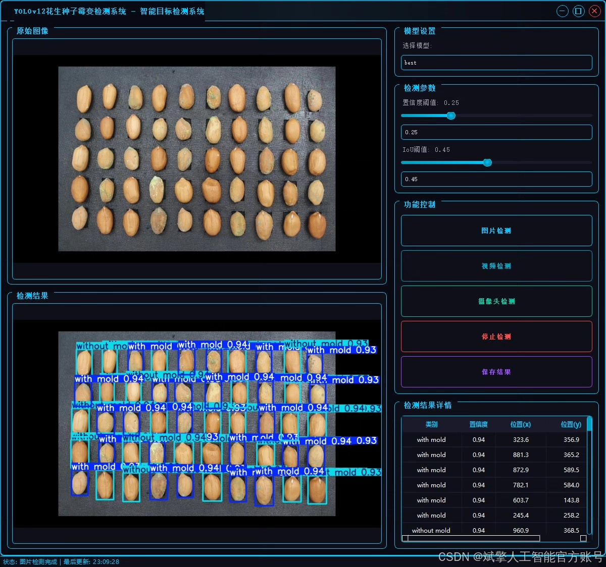
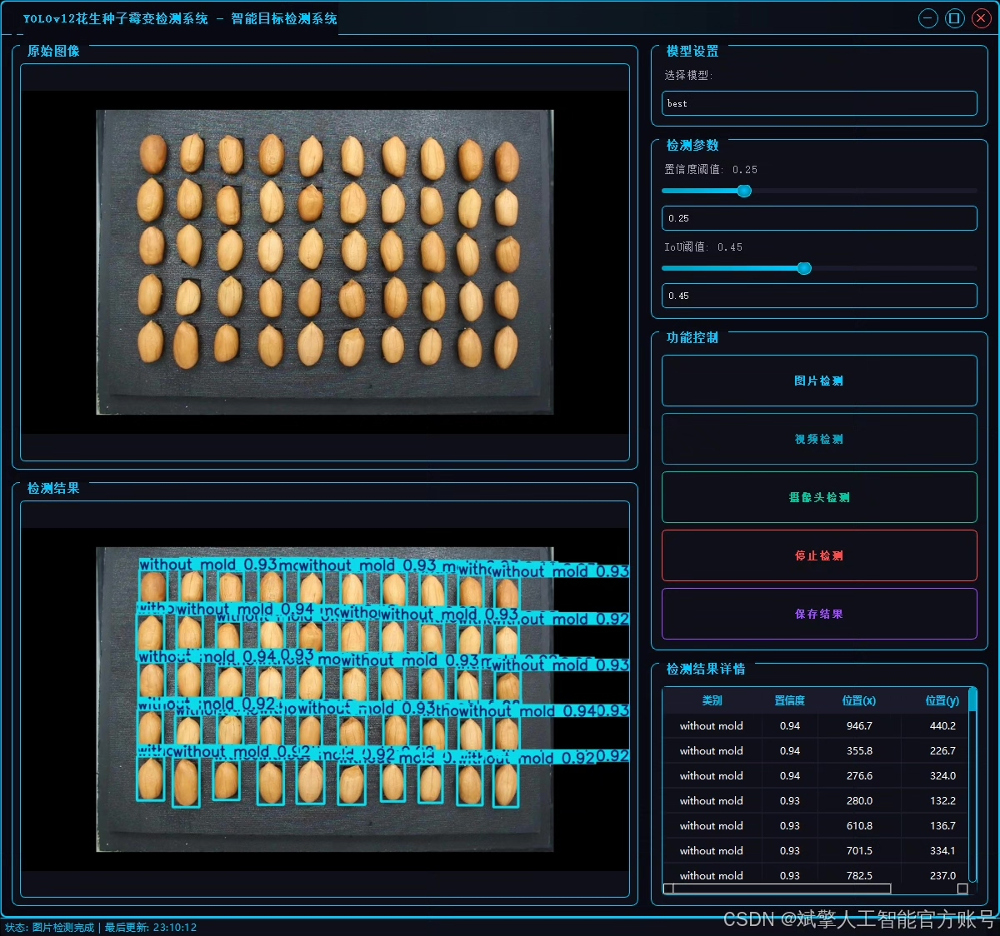
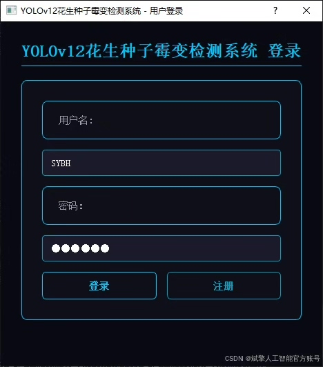
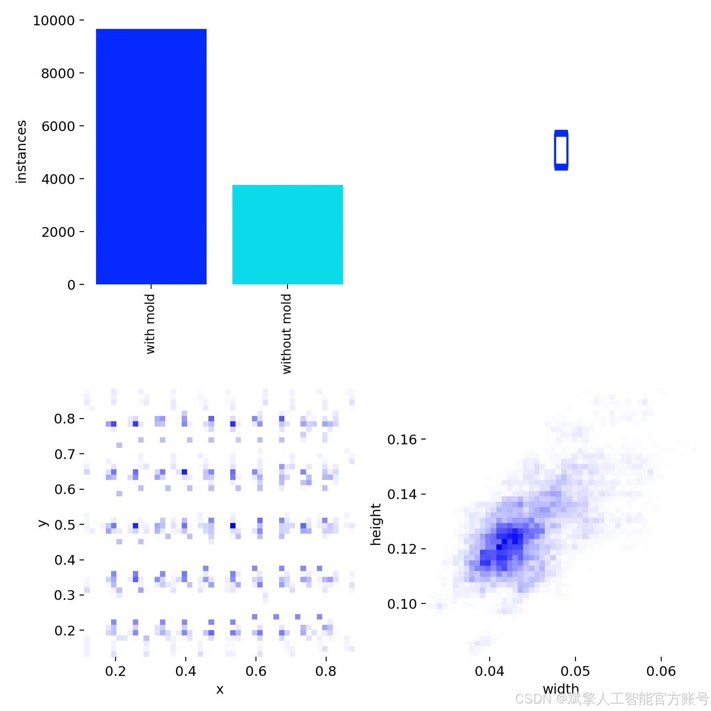
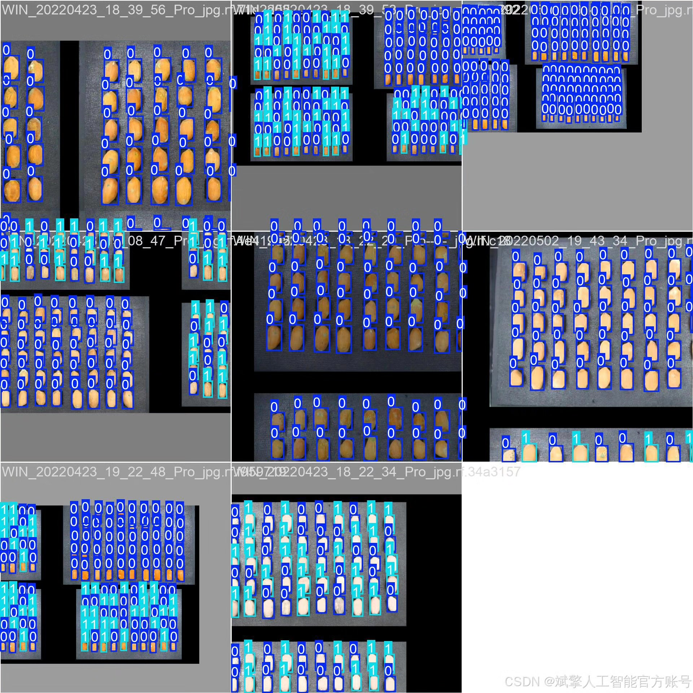
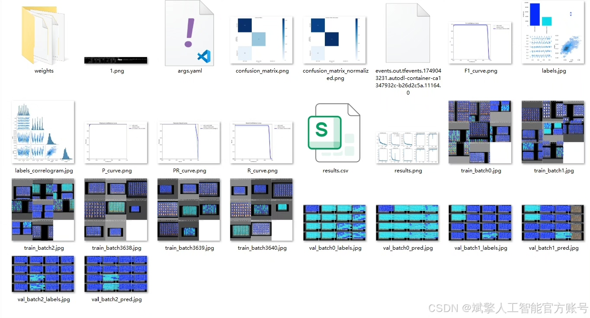
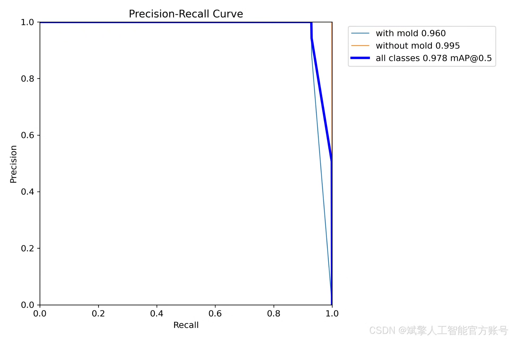
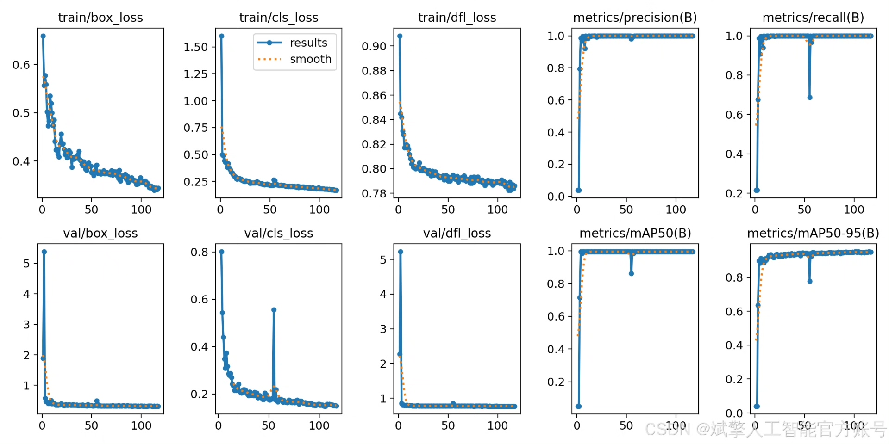
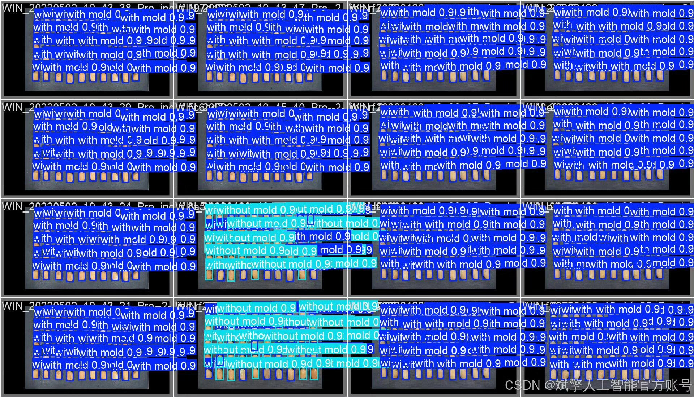

# YOLOv12 peanut mold detection system

## Body

YOLOv12 Peanut Blight Identification System Based on Deep Learning YOLOv12: A Peanut Seed Blight Detection System (YOLOv12+YOLO dataset + UI interface + login and registration interface + Python project source code + model)

This study has developed a peanut seed blight detection system based on the latest YOLOv12 deep learning algorithm, achieving rapid and accurate identification of peanut seed blight. The system employs advanced computer vision technology to efficiently distinguish between "blighted" and "unblighted" peanut seeds. The project includes complete Python implementation, user-friendly UI interface, and a secure login and registration system, providing an intelligent solution for agricultural product quality inspection.

✅ User Login and Registration: Supports password verification and security validation.
✅ Three Detection Modes: Based on the YOLOv12 model, supports image, video, and real-time camera detection, accurately identifying targets.
✅ Dual-Screen Comparison: Displays the original scene and detection results on the same screen.
✅ Data Visualization: Real-time table displaying the category, confidence, and coordinates of detected targets.
✅ Intelligent Parameter Tuning: Offers a confidence slide bar to dynamically optimize detection accuracy, adapting to different scene requirements.
✅ Sci-Fi Interactive Interface: Dark theme paired with dynamic light effects, reducing visual fatigue and enhancing operational experience.

## Images

## Payment

Here is a pay link on Stripe ( https://buy.stripe.com/3cs8yP7sY87d0vu9AB ). Please contact me lonlonago@foxmail.com after funding $89, and I will send you a complete data files , thank you!

